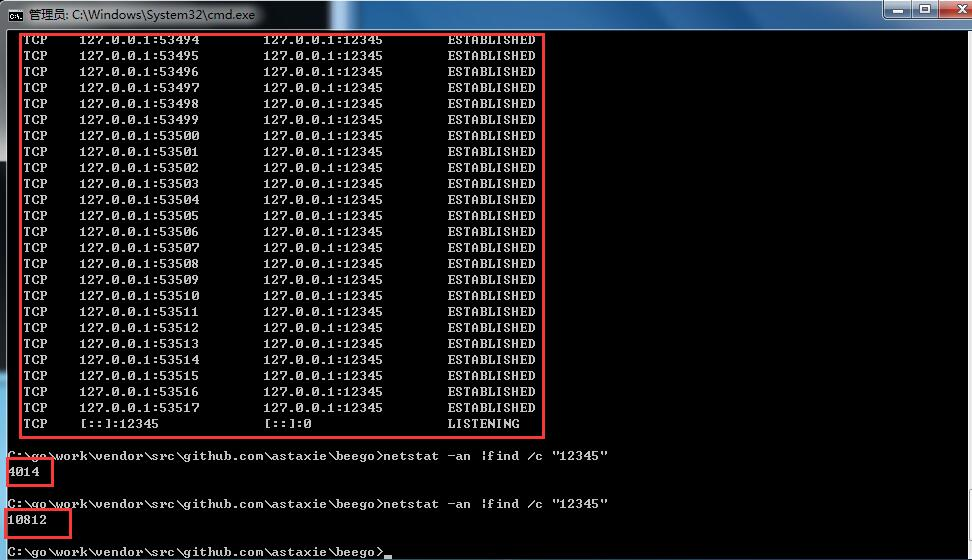

# 当GOLang遇到大量ESTABLISHED的分析及解决方案
## 现象描述
当Go程序(两个GO程序互为服务端、客户端)运行一段时间后，使用netstat -a查看，就出现大量ESTABLISHED的连接，且久久保持不断开。

客户端连接代码如下：
```
client := &http.Client{}
	client.Transport = tr
	req, err := http.NewRequest(metod, url, strings.NewReader(""))
	if err != nil {
		fmt.Println("http.NewRequest error", err)
		return
	}

	resp, err := client.Do(req)
	if resp != nil {
		defer resp.Body.Close()
	}
	if err != nil {
		fmt.Println("client.Do error", err)
		return
	}

	body, err := ioutil.ReadAll(resp.Body)
	if err != nil {
		fmt.Println("ioutil.ReadAll error", err)
	}
```
## 问题定位
一般来说就是在进行HTTP(TCP)调用时没有断开或者说关闭连接造成的。<br>
首先排查服务端,分别访问baidu,beego官网，同样会出现ESTABLISHED问题。
```
func TestRequetToBeego(t *testing.T) {
	var N = 100000
	for i := 0; i < N; i++ {
		transport := &http.Transport{}
		httpDo("GET", "https://beego.me/", transport)
		time.Sleep(time.Millisecond * 10)
	}
	time.Sleep(time.Second * 60)
}
func TestRequetToBaidu(t *testing.T) {
	var N = 100000
	for i := 0; i < N; i++ {
		transport := &http.Transport{}
		httpDo("GET", "http://www.baidu.com/", transport)
		time.Sleep(time.Millisecond * 10)
	}
	time.Sleep(time.Second * 60)
}
```

重点排查客户端的go程序，查阅client源代码,发现线索，如果Transport没有设置，那么会使用DefaultTransport。
```
type Client struct {
	// Transport specifies the mechanism by which individual
	// HTTP requests are made.
	// If nil, DefaultTransport is used.
	Transport RoundTripper
	... 
}	
```
将测试用例改为使用DefaultTransport，发现不会出现ESTABLISHED问题，进一步分析DefaultTransport。
```
var DefaultTransport RoundTripper = &Transport{
	Proxy: ProxyFromEnvironment,
	DialContext: (&net.Dialer{
		Timeout:   30 * time.Second,
		KeepAlive: 30 * time.Second,
		DualStack: true,
	}).DialContext,
	MaxIdleConns:          100,
	IdleConnTimeout:       90 * time.Second,
	TLSHandshakeTimeout:   10 * time.Second,
	ExpectContinueTimeout: 1 * time.Second,
}
```
再次分析，定位为IdleConnTimeout
```
// IdleConnTimeout is the maximum amount of time an idle
	// (keep-alive) connection will remain idle before closing
	// itself.
	// Zero means no limit.
	IdleConnTimeout time.Duration
```
参考该字段含义，设置自定义的Transport.IdleConnTimeou=2 * time.Second,
ESTABLISHED问题解决。

## 解决方案
          

## 扩展阅读          